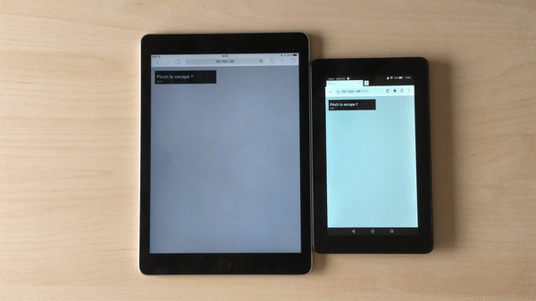
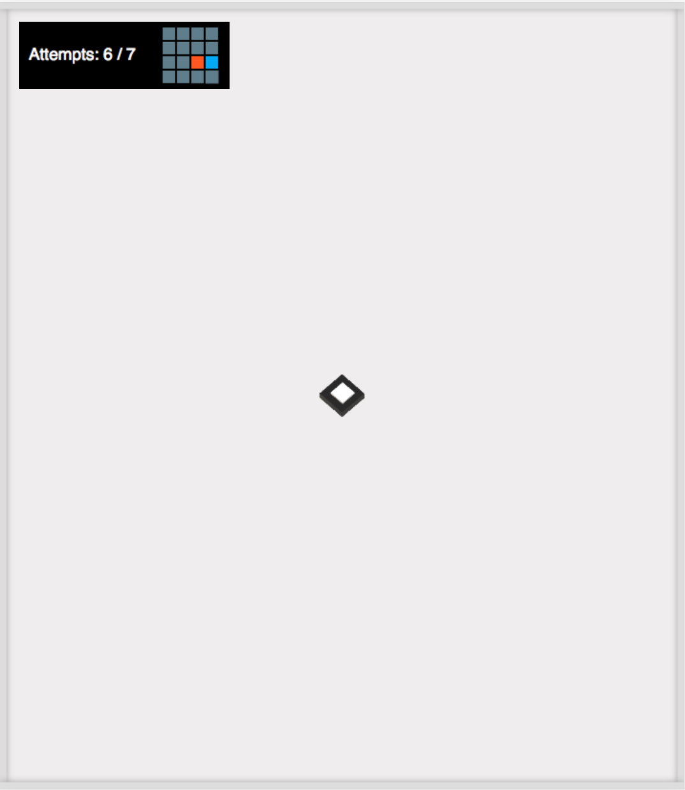
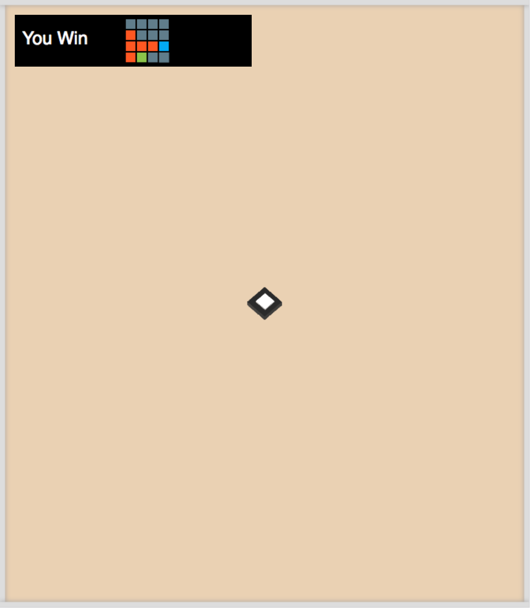
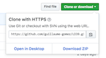

## About
The concept of this game if fairly simple, there’s a map, you and your friend (represented by the diamond shaped element) are stuck in there and need to find the exit. You can move in 4 directions and to do so you'll have to use your devices.
For instance, to move to the right, it's super easy : You put your second device on the right of the first one
and you just pinch ! The second device become the new spot where you and your friend are (as seen on
the mini map in game) and you keep on going until you find the exit ! (before you run out of power and die a horrible death of course ^^)

## Dev process

For this LD, the theme being running out of power, we thought about an "escape before
it's too late" kind of game but with a interesting twist in the gameplay.
In this game, to move from one room to another you use 2 real life devices
to build your path !
We used a library called [Swip JS](https://github.com/paulsonnentag/swip) that let you connect several devices (smartphones, iphones, ipads,
or even a laptop with touch screen) with only one move, a pinch on the screens.

Since we had to go on the LD39 journey with a super small team, we decided to keep
all the other fancy elements, like graphics or music, super low key with room for future
improvements.

All assets have been made during the event.

## Screenshots







### Controls
- Move : Your fingers

## Team
- Maxime Lambert: Concept / Game Design
- Guillaume Gomez: Programming

## Set up Project

### Install dependency
The project has one dependency : NodeJs.

So first let's install it :

#### Windows and MacOs
You can download installer on the [NodeJs website](https://nodejs.org/en/).

#### Linux
Open a terminal
```
    sudo apt-get update
    curl -sL https://deb.nodesource.com/setup_8.x | sudo -E bash -
    sudo apt-get install -y nodejs
 ```

### Compile and start the game

You need to get the sources.
So click to download ZIP on the github main page of the game


I will assume you extract the zip directly in Downloads folders.
You can extract it in another folder you will have able to identify how to go to it by youself in command line

### Windows, Linux and Mac
open a terminal
  if you put the game in Downloads' folder, type
  ```
  cd Downloads/LD39-master
  ```

Then copy and paste commands from the section Build from sources

## Build from sources
```
npm install
npm run build
cd client
npm install
npm run build
cd ..
npm start
```
__ the last commands launch the

Ok, so your serveur is launched.
if you want to see the result go to `localhost:3000` on your browser.
But, I does not work on your devices( Smartphone, Iphone, Ipads, Kindle, etc) for network reason.
Anyway, connect your devices in the same network as your Pc (by simply connecting your device on WIFI).

The Last tricky part it is to identify the local network address.

So on linux, and mac, open a terminal and enter
```
  ipconfig
```
[mac-inet](screenshots/mac) for instance my local address is `192.168.1.98`

on Windows, on a terminal too, and enter
```
  ifconfig
```
and remember the ipv4 section
[mac-inet](screenshots/ipv4-windows) for instance my local address is `192.168.1.98`

** Otherwise your MAC adress, the local adress can change, so don't hesitate to check this address. It may changed when your computer leave the network( basicaly when you turn of your computer) **


## Let's play
After all this configuration, you deversed to try it out the game.
So open a browser on yout both devices, and go to IPV4address:3000.
In my case
  on linux, i went go `192.168.1.98:3000`
  on windows, i went to `192.168.1.125`

The game will start on your devices.

If something went wrong, don't hesitate to restart the server by killing the terminal where the server is running.
And restart it with command `npm start` (in the folder LD39-master of course)

Enjoy !

_the server can be still buggy :| , but i will work on it_


### Let's play
