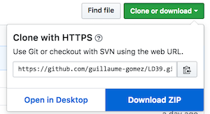

## About
The concept of this game if fairly simple, there’s a map, you and your friend (represented by the diamond shaped element) are stuck in there and need to find the exit. You can move in 4 directions and to do so you'll have to use your devices.
For instance, to move to the right, it's super easy : You put your second device on the right of the first one
and you just pinch ! The second device become the new spot where you and your friend are (as seen on
the mini map in game) and you keep on going until you find the exit ! (before you run out of power and die a horrible death of course ^^)

## Dev process

For this LD, the theme being running out of power, we thought about an "escape before
it's too late" kind of game but with a interesting twist in the gameplay.
In this game, to move from one room to another you use 2 real life devices
to build your path !
We used a library called [Swip JS](https://github.com/paulsonnentag/swip) that let you connect several devices (smartphones, iphones, ipads,
or even a laptop with touch screen) with only one move, a pinch on the screens.

Since we had to go on the LD39 journey with a super small team, we decided to keep
all the other fancy elements, like graphics or music, super low key with room for future
improvements.

All assets have been made during the event.

## Screenshots


### Controls
- Move : Your fingers

## Team
- Maxime Lambert: Concept / Game Design
- Guillaume Gomez: Programming

## Set up Project

### Install dependency
The project has one dependency : NodeJs.

So first let's install it :

#### Windows and MacOs
You can download installer on the [NodeJs website](https://nodejs.org/en/).

#### Linux
Open a terminal
```
    sudo apt-get update
    curl -sL https://deb.nodesource.com/setup_8.x | sudo -E bash -
    sudo apt-get install -y nodejs
 ```

### Compile and start the game

You have to get the sources.
To do it, you need to download the ZIP folder of the game on [Github](https://github.com/guillaume-gomez/LD39) (like in the picture below).


For the next steps, let's consider that you **have extracted the ZIP** directly in the Downloads folder( you can extract it whatever you want but you will need to adapt the path in the command lines in the next part of the guide).

## Build from sources

#### Windows, Linux and Mac
Open a terminal, and type the following
```
cd Downloads/LD39-master
npm install
npm run build
cd client
npm install
npm run build
cd ..
npm start
```
_The last command launch the server_.

Ok, so your serveur is started( Do not kill the terminal until you stop playing the game).
Now you can see the result on your computer, to visualize go to `localhost:3000` on your favorite browser.

There is one last step to connect your portable devices( Smartphone, Iphone, Ipads, Kindle, etc).

You will need your network local address by typing in **another** terminal( your devices need to be connected on the same network as your pc by simply connecting your device on WIFI).

So on linux, and mac, open a terminal and enter
```
  ifconfig
```

For instance my local address is `192.168.1.98`

On Windows, on a terminal too, and enter
```
  ipconfig
```


For instance my local address is `192.168.1.98`

** The local adress can change, so don't hesitate to check this address. It may changed when your computer leave the network (basicaly when you turn off your computer) **

## Let's play
You can now play the game easilly
Open a browser on both your devices, and type `(YourLocalAddress):3000.` (in your case `192.168.1.98:3000`)

The game will start on your devices.

If something went wrong, don't hesitate to restart the server by killing the terminal where the server is running.
And restart it with command `npm start` (in the folder LD39-master of course)

Enjoy !

_the server can be still buggy :| , but I will work on it_
